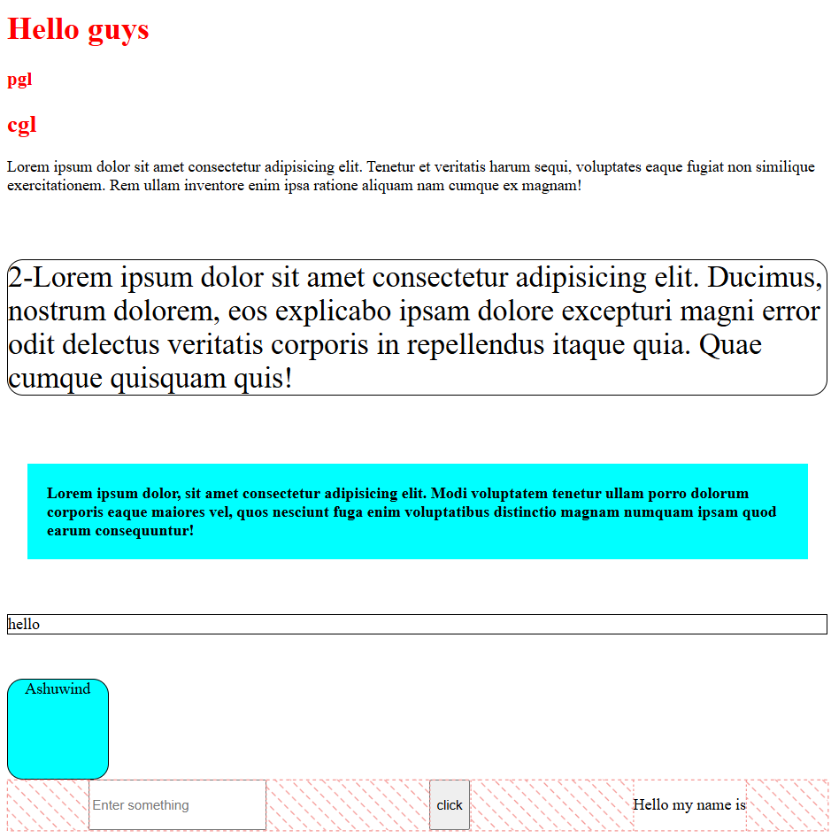

# Prototype-Tailwind

A lightweight utility-first styling framework built with vanilla JavaScript.

This project was created to understand how utility CSS frameworks such as Tailwind CSS work internally.

Instead of writing traditional CSS classes, styles are applied through small utility classes directly in HTML.

Example:

```html
<p class="ashu-p-2 ashu-b-cyan ashu-b-500">
    Hello World
</p>
```

The framework dynamically converts utility classes into CSS styles at runtime.

---

## Features

### Typography

```html
ashu-b-500
ashu-fs-3
ashu-c-red
```

Output:

```css
font-weight: bold;
font-size: 30px;
color: red;
```

### Spacing

```html
ashu-p-2
ashu-m-2
ashu-mt-1
```

Output:

```css
padding: 20px;
margin: 20px;
margin-top: 10px;
```

### Backgrounds

```html
ashu-b-cyan
```

Output:

```css
background-color: cyan;
```

### Borders

```html
ashu-b-black
ashu-br-16
```

Output:

```css
border: 1px solid black;
border-radius: 16px;
```

### Sizing

```html
ashu-w-100
ashu-h-100
ashu-w-auto
ashu-h-auto
```

Output:

```css
width: 100px;
height: 100px;
width: auto;
height: auto;
```

### Text Alignment

```html
ashu-text-center
```

Output:

```css
text-align: center;
```

### Flexbox Utilities

```html
ashu-flex
ashu-jc-center
ashu-jc-spcBtw
ashu-jc-spcEven
ashu-jc-spcArnd
```

Output:

```css
display: flex;
justify-content: center;
justify-content: space-between;
justify-content: space-evenly;
justify-content: space-around;
```

---

## How It Works

The framework stores utility definitions in a JavaScript object.

```javascript
const utilities = {
    "ashu-p-2": ["padding", "20px"],
    "ashu-m-2": ["margin", "20px"],
    "ashu-c-red": ["color", "red"]
};
```

The script scans elements for utility classes and dynamically applies styles:

```javascript
for (const element of elements) {
    for (const key in utilities) {

        if (element.classList.contains(key)) {

            const [property, value] = utilities[key];

            element.style[property] = value;
        }
    }
}
```

---

## Example

HTML:

```html
<div class="ashu-b-black ashu-br-16 ashu-b-cyan ashu-w-100 ashu-h-100 ashu-text-center">
    Ashuwind
</div>
```

Generated styles:

```css
border: 1px solid black;
border-radius: 16px;
background-color: cyan;
width: 100px;
height: 100px;
text-align: center;
```

---

## Why I Built This

This project was built as a learning exercise to understand:

- DOM manipulation
- querySelectorAll()
- classList.contains()
- Dynamic styling with JavaScript
- Utility-first CSS architecture
- How frameworks like Tailwind map utility classes to CSS properties

---

## Limitations

This is a learning project and differs from Tailwind CSS:

- Styles are applied at runtime using JavaScript
- No build process
- No responsive breakpoints
- No pseudo-class support
- No theme configuration
- No CSS generation

---

## Future Improvements

- Responsive utilities
- Hover and focus states
- Color palette system
- Custom spacing scale
- Grid utilities
- Automatic utility parser
- Configuration file support

---

## ScreenShot


## Author

Ashu

Learning project focused on understanding utility-first CSS framework design and DOM-based style generation.